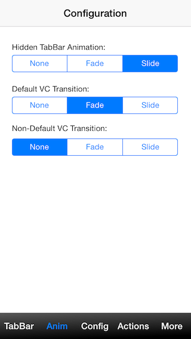
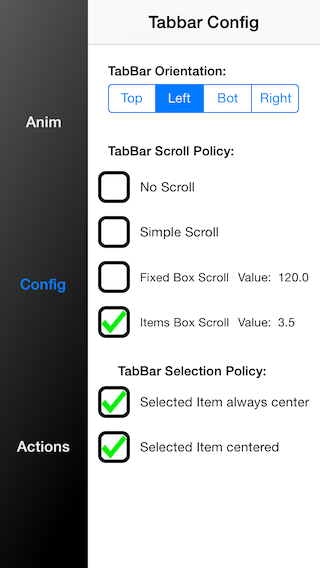
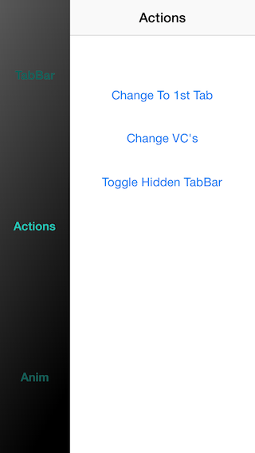
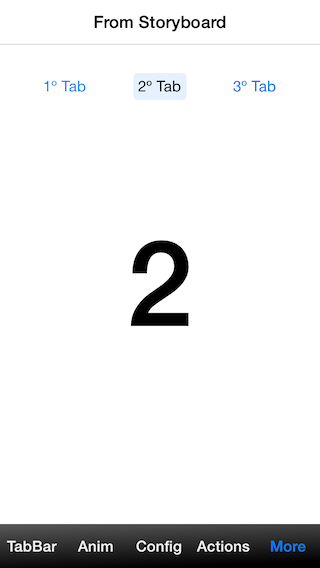

JJTabBarController
==================

Create a TabBarController as it should be.

Support for iOS 6.0 and superior.

Current version: 1.0

####Functionality :
 - Personalize your TabBar.
 - Built-in transitions.
 - Choose the TabBar orientation.
 - Storyboard integration.
 - Easily add new actions for the TabBar with blocks.

####How to create

    // import lib
    #import "JJTabBarControllerLib.h"

	// Create a controller 1
	UIViewController *viewController1 = [[UIViewController alloc] initWithNibName:nil bundle:nil];
    viewController1.jjTabBarButton = [UIButton buttonWithType:UIButtonTypeContactAdd];

	// Create a controller 2
    UIViewController *viewController2 = [[UIViewController alloc] initWithNibName:nil bundle:nil];
    viewController2.jjTabBarButton = [UIButton buttonWithType:UIButtonTypeInfoDark];

    // Add to tabbarController
	_tabBarController = [[JJTabBarController alloc] initWithSize:CGSizeMake(88,44) andDockPosition:JJTabBarDockBottom];
    _tabBarController.childViewControllers = @[ controller1, controller2];
    [self addChildViewController:_tabBarController];
    [self.view addSubview:_tabBarController.view];
    [_tabBarController didMoveToParentViewController:self];

Download the project and see the example on how to do more advance features.

For cocoapods use:

	pod 'JJTabBarController', '~> 1.0'

####Screenshots

####More:

Suggestions and Contributions email: joaofrjesusbe at gmail.com

License: MIT License
